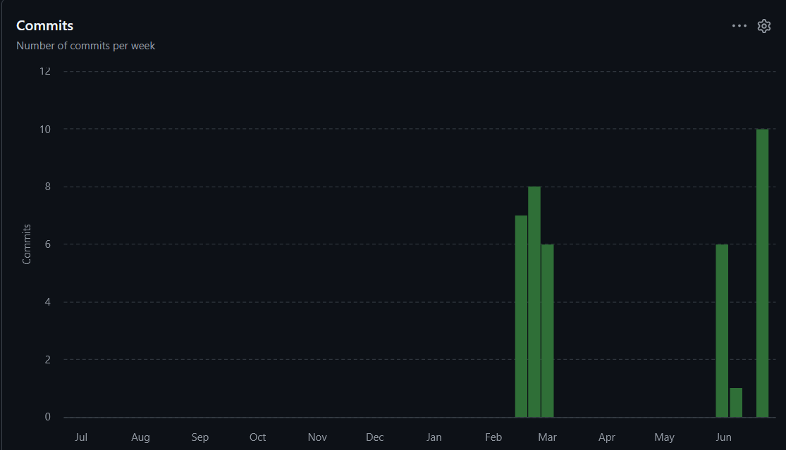
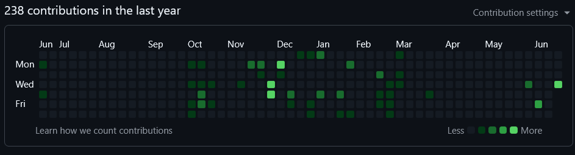

# Ecampus UniPlanner

**Ecampus UniPlanner** — кроссплатформенный студенческий органайзер. Проект предоставляет единый интерфейс для просмотра расписания (автоматически получаемого с сайта университета), управления задачами, заметками и получения уведомлений.

## Траектория курсового проекта

Курсовой проект защищается по **траектории Б («Веб-ориентированная»)** методички дисциплины «Программная инженерия»: тонкий клиент (React), серверная часть на Spring Boot, REST API, PostgreSQL. Архитектурный паттерн — **PCMEF** (Presentation-Control-Mediator-Entity-Foundation), адаптированный под Kotlin/Spring (см. `docs/02-architecture/pcmef-diagram.md`).

KMP shared-модуль и заготовка Android-клиента — архитектурный запас на будущее (мобильный клиент), не входят в обязательные требования трактории Б и реализуются по остаточному принципу, если хватит времени.

## Архитектура

Проект представляет собой монорепозиторий, содержащий:

- **Gradle-модули**:
  - `shared` — общий Kotlin Multiplatform модуль с моделями данных (экспорт для JVM и JS).
  - `backend` — серверное приложение на Kotlin + Spring Boot, слои PCMEF.
  - `android` — задел под будущий Android-клиент на Jetpack Compose (не реализуется в текущей итерации).

- **Внешние сервисы**:
  - `web` — фронтенд на React + TypeScript + Vite.
  - `parser` — микросервис на Python (FastAPI) для парсинга расписания с информационной системы университета (cookie-авторизация). За основу взят проект телеграм-бота [CampusBOT](https://github.com/alikhan902/CampusBOT). Имеет собственную БД `uniplanner_parser`, отдельную от БД бэкенда.

- **Общие артефакты**:
  - `api/*.yaml` — спецификация OpenAPI для взаимодействия между компонентами (живая документация генерируется springdoc на `/api/v1/swagger-ui.html`).

## Технологический стек

| Компонент           | Технологии                                                                 |
|---------------------|----------------------------------------------------------------------------|
| Shared-модуль       | Kotlin Multiplatform (JVM + JS таргеты), kotlinx.serialization              |
| Бэкенд              | Kotlin, Spring Boot 3, Spring Data JPA, Spring Security, JWT, Flyway, PostgreSQL |
| Веб-клиент          | React, TypeScript, Vite                                                    |
| Android-клиент      | Kotlin, Jetpack Compose (план на будущее, не в текущей итерации)           |
| Парсер              | Python, FastAPI, SQLAlchemy, BeautifulSoup, PostgreSQL (своя БД)            |
| Инфраструктура      | Gradle, Docker / docker-compose (опционально)                              |

## Структура проекта

```bash
ecampus-uniplanner/
├── api/                      # OpenAPI спецификация (контракт)
├── backend/                  # Spring Boot бэкенд (PCMEF-слои)
├── shared/                   # KMP-модуль с моделями
├── docs/                     # Документация курсового проекта (по этапам методички)
├── android/                  # Задел под будущий Android-клиент
├── web/                      # React-клиент
├── parser/                   # Python-сервис парсера (на основе CampusBot)
├── gradle/                   # Gradle wrapper и version catalog
├── build.gradle.kts          # Корневой скрипт сборки
├── settings.gradle.kts       # Настройки проекта
├── gradle.properties         # Свойства Gradle
└── README.md                 # Этот файл
```

## Документация по этапам

```
docs/
├── 00-project-charter/   # Паспорт проекта, глоссарий, стейкхолдеры
├── 01-requirements/      # Доменная модель, Use Case, трассировка требований
├── 02-architecture/      # PCMEF, выделение микросервиса-парсера, ADR
├── 03-database/          # ER-диаграмма, миграции, ограничения целостности
├── 04-detailed-design/   # Диаграмма классов, REST API, диаграммы последовательности
├── 05-implementation/    # Структура кода backend, найденные и исправленные баги
├── 06-testing/           # Стратегия тестирования, покрытие
├── 07-ui/                # FSD-архитектура фронтенда, описание экранов
├── 08-deployment/        # Развёртывание (Docker Compose), переменные окружения
├── 09-user-guide/        # Руководство пользователя
├── 10-final-report/      # Итоги проекта, осознанные упрощения
└── HANDOFF.md            # Заметка для продолжения работы в чате (не часть отчёта)
```

Каждый этап содержит свой `README.md` с обзором и списком артефактов — начать стоит с [docs/00-project-charter/README.md](docs/00-project-charter/README.md).

## Разработка

- Все модели данных находятся в `shared/src/commonMain/kotlin/ru/uniplanner/shared/`.
- Для добавления новой модели:
  1. Создайте data-класс с аннотациями `@Serializable` и `@JsExport`.
  2. Выполните `./gradlew :shared:rebuildJsDev` (пересобирает и копирует JS/d.mts в `web/src/shared/kmp/dto/`).
  3. Импортируйте типы в React через мост `web/src/shared/kmp/index.ts` (см. [docs/05-implementation/code-structure.md](docs/05-implementation/code-structure.md) про известные шероховатости генерации `.d.mts`).
- Backend требует JDK 21. Если в `PATH`/`JAVA_HOME` стоит другая версия Java, передайте `JAVA_HOME` явно при вызове Gradle (например, `$env:JAVA_HOME = 'C:\Program Files\Eclipse Adoptium\jdk-21.0.8.9-hotspot'` в PowerShell перед `./gradlew`). В Docker-сборке (`backend/Dockerfile`) JDK 21 уже корректный по умолчанию.

## Статистика разработки

_Раздел заполняется перед сдачей проекта финальными скриншотами GitHub Insights._

### Метрики Git
- Всего коммитов: 38
- Период: 28 июня 2025 — 21 июня 2026
- Средняя частота: 0.75 коммита/неделю

### График активности


### Тепловая карта

