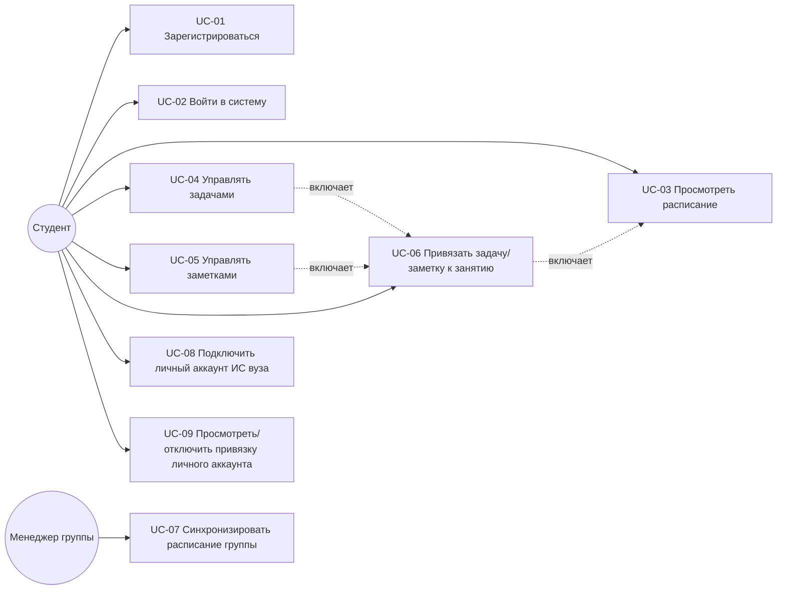

# Use Case диаграмма

## Актёры

| Актёр | Описание |
|---|---|
| Студент (`ROLE_USER`) | Основной пользователь — ведёт задачи/заметки, просматривает расписание своей группы |
| Менеджер группы (`ROLE_MANAGER`) | Расширенная роль — вызывает синхронизацию расписания группы с парсером |

Роль `ROLE_ADMIN` зарезервирована (см. модель ролей в [02-architecture/pcmef-diagram.md](../02-architecture/pcmef-diagram.md)), отдельных UC для неё в текущей итерации не реализовано — см. отложенный пункт «админ-панель» в [10-final-report/summary.md](../10-final-report/summary.md).
