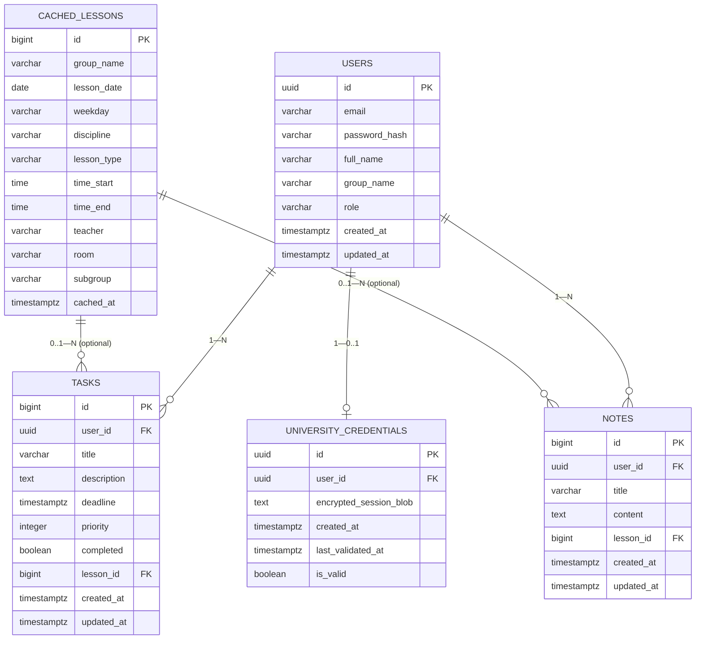

# Модель данных backend

БД бэкенда (`uniplanner_backend`) отделена от БД парсера (`uniplanner_parser`) — см. [02-architecture/microservices.md](../02-architecture/microservices.md).

## ER-диаграмма (актуальная схема, после V1—V4)

`CACHED_LESSONS` не имеет FK на `USERS` для целей чтения расписания — связь идёт через `group_name` пользователя (денормализация для скорости чтения, кэш данных парсера). Связь с `TASKS`/`NOTES` через `lesson_id` (V4) — точечная привязка конкретной задачи/заметки к занятию, независимая от `group_name`.

## Ограничения целостности

- `users.role` — CHECK на одно из `ROLE_USER`/`ROLE_ADMIN`/`ROLE_MANAGER`.
- `users.email` — CHECK на формат email + UNIQUE индекс.
- `tasks.priority` — CHECK 1..5 (продублирован на уровне Entity через `init { require(...) }`).
- `cached_lessons` — CHECK `time_end > time_start`.
- `tasks.lesson_id`/`notes.lesson_id` — FK на `cached_lessons(id)`, `ON DELETE SET NULL` (удаление занятия из кэша не удаляет задачу/заметку, только отвязывает).
- `university_credentials.user_id` — UNIQUE (один привязанный личный аккаунт ИС вуза на пользователя), `ON DELETE CASCADE`.
- Триггеры `update_updated_at_column()` на `users`/`tasks`/`notes`.

## Миграции

- `V1__init_schema.sql` — базовая схема (`users`, `tasks`, `notes`, `cached_lessons`).
- `V2__seed_demo_lessons.sql` — demo-данные расписания, используются как fallback при отсутствии живой синхронизации (см. [02-architecture/microservices.md](../02-architecture/microservices.md)).
- `V3__add_university_credentials.sql` — таблица `university_credentials` для личного входа в ИС вуза через капчу.
- `V4__add_lesson_links.sql` — `lesson_id` в `tasks`/`notes`, индексы `idx_tasks_lesson_id`/`idx_notes_lesson_id`.
