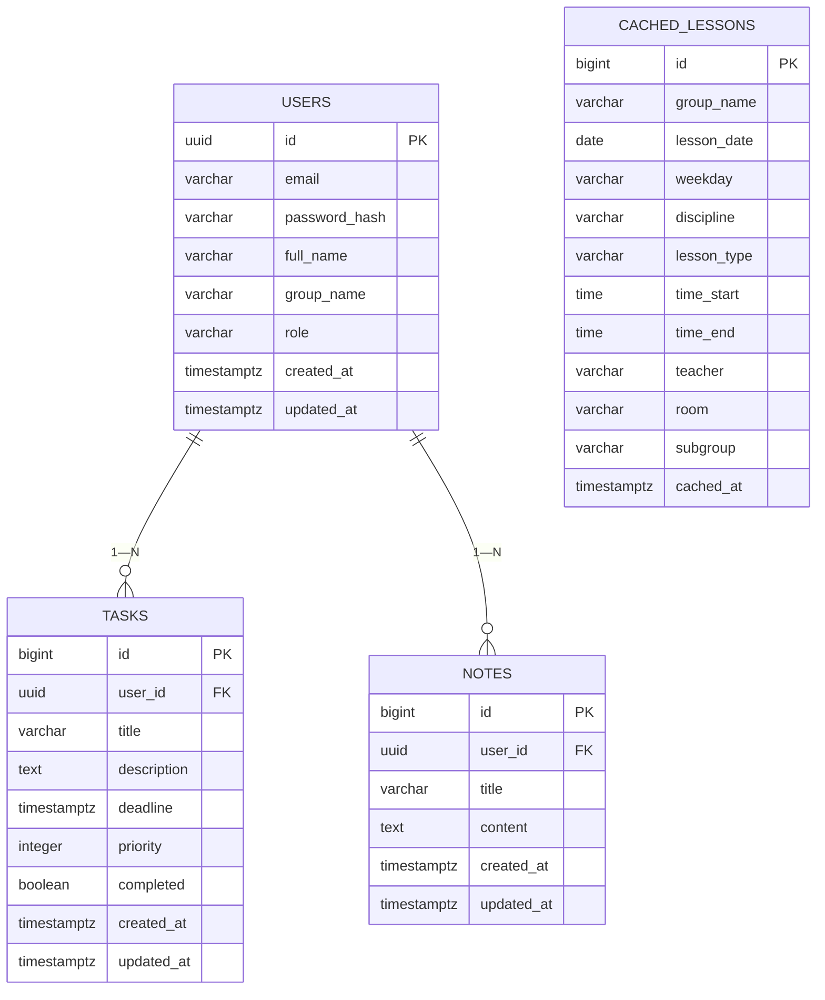

# Модель данных backend

БД бэкенда (`uniplanner_backend`) отделена от БД парсера (`uniplanner_parser`) — см. вводные проекта и `docs/03-architecture/microservices.md`.

## ER-диаграмма (backend, V1__init_schema.sql + V2__seed_demo_lessons.sql)

`CACHED_LESSONS` не имеет FK на `USERS` — связь с пользователем идёт через `group_name` пользователя (денормализация для скорости чтения расписания, кэш данных парсера).

## Ограничения целостности

- `users.role` — CHECK на одно из `ROLE_USER`/`ROLE_ADMIN`/`ROLE_MANAGER`.
- `users.email` — CHECK на формат email + UNIQUE индекс.
- `tasks.priority` — CHECK 1..5 (продублирован на уровне Entity через `init { require(...) }`).
- `cached_lessons` — CHECK `time_end > time_start`.
- Триггеры `update_updated_at_column()` на `users`/`tasks`/`notes`.

## Миграции

- `V1__init_schema.sql` — базовая схема.
- `V2__seed_demo_lessons.sql` — демо-данные расписания (временная замена живой интеграции с парсером, см. `docs/08-final/summary.md`).
