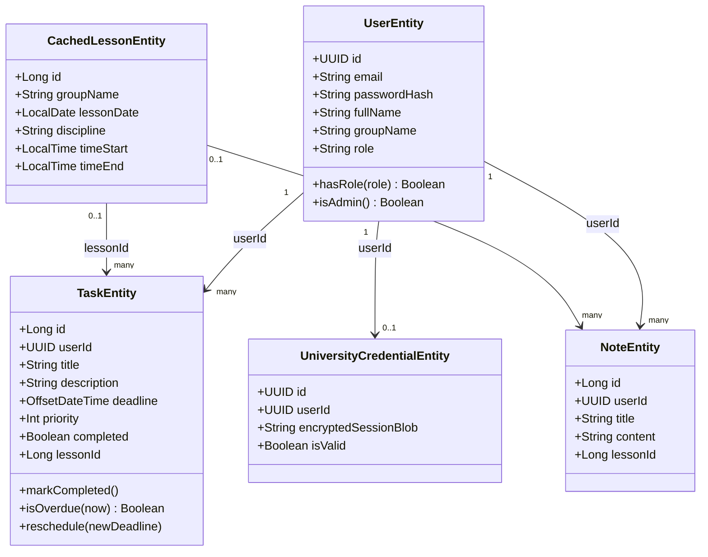

# Диаграмма классов (слой Entity)

`TaskEntity.priority` ограничен инвариантом `init { require(priority in 1..5) }` — бизнес-правило хранится в Entity, не в Control/Mediator (соответствует не-анемичной модели PCMEF).

## Интерфейсы слоя Mediator (контракты сервисов)

| Интерфейс | Реализация | Ключевые методы |
|---|---|---|
| `IAuthService` | `AuthServiceImpl` | `register()`, `login()`, `getCurrentUser()` |
| `ITaskService` | `TaskServiceImpl` | `list(userId, lessonId?)`, `create()`, `update()`, `delete()` |
| `INoteService` | `NoteServiceImpl` | `list(userId, lessonId?)`, `create()`, `update()`, `delete()` |
| `IScheduleService` | `ScheduleServiceImpl` | `getLessons(group, from, to)`, `listGroups()` |
| `IParserSyncService` | `ParserSyncServiceImpl` | `syncGroupSchedule(group, from, to)` |
| `IUniversityAuthService` | `UniversityAuthServiceImpl` | `startCaptchaChallenge()`, `completeLogin()`, `getLinkStatus()`, `unlink()` |
