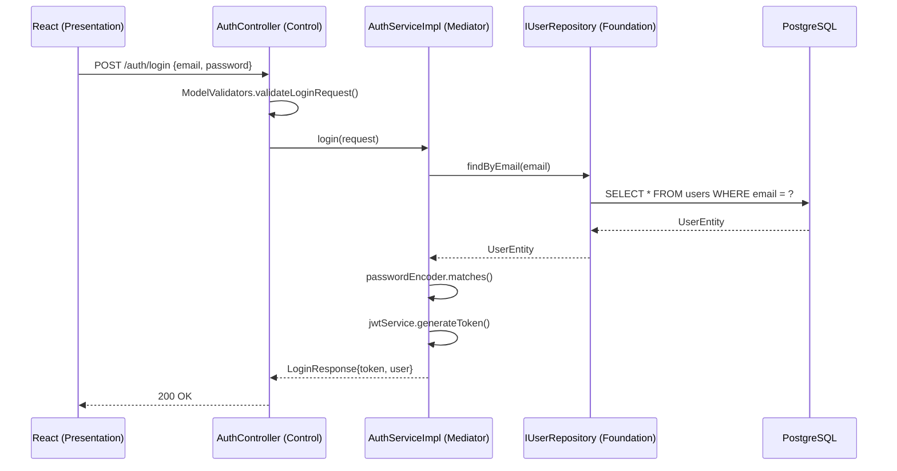
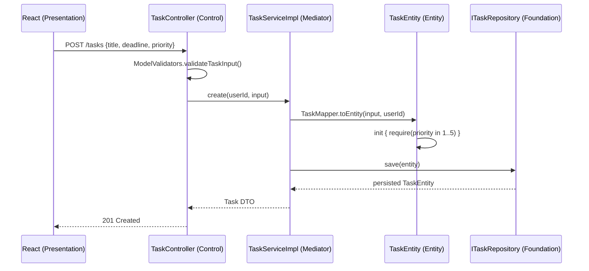
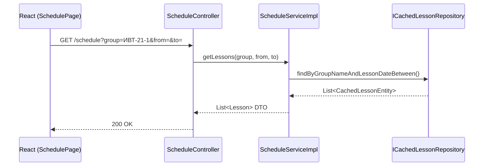
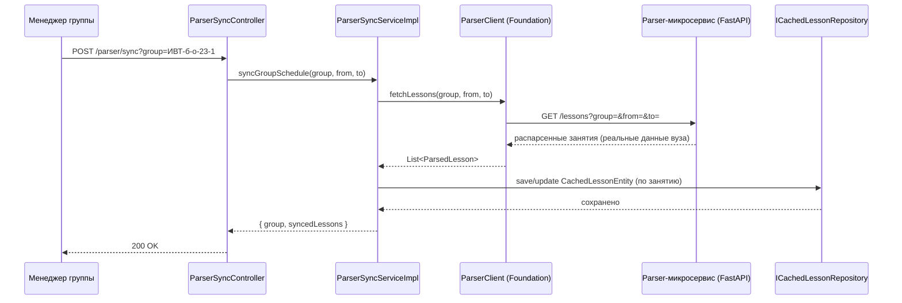
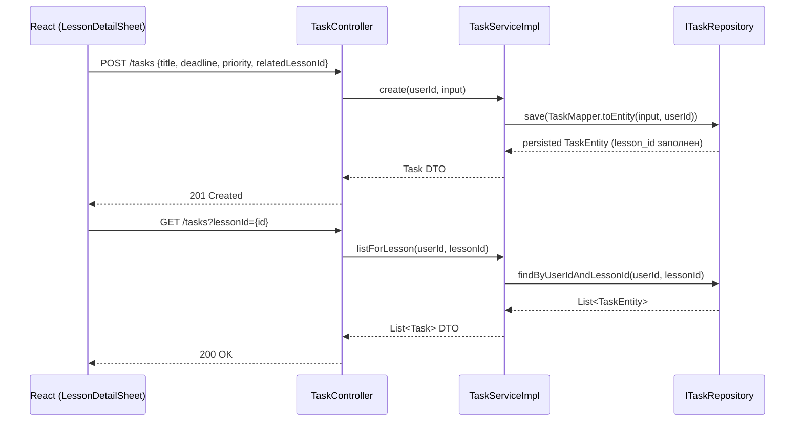

# Диаграммы последовательности

## 1. Login flow

## 2. Создание задачи

## 3. Расписание (чтение из кэша backend'а)

## 4. Синхронизация расписания с парсером (UC-07)

## 5. Привязка задачи к занятию (UC-06)

