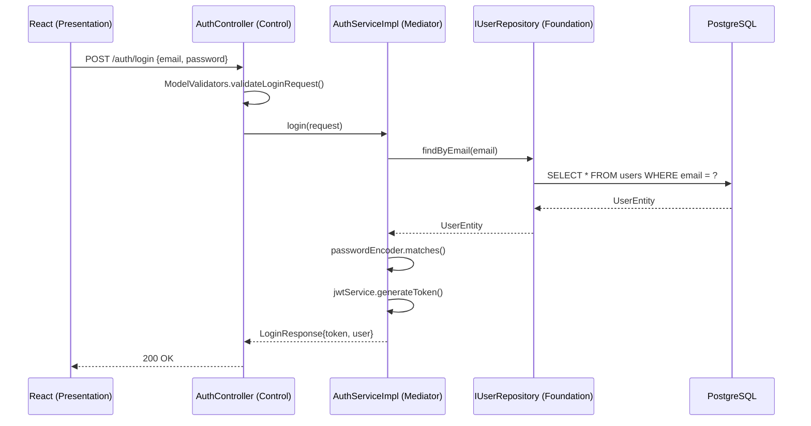
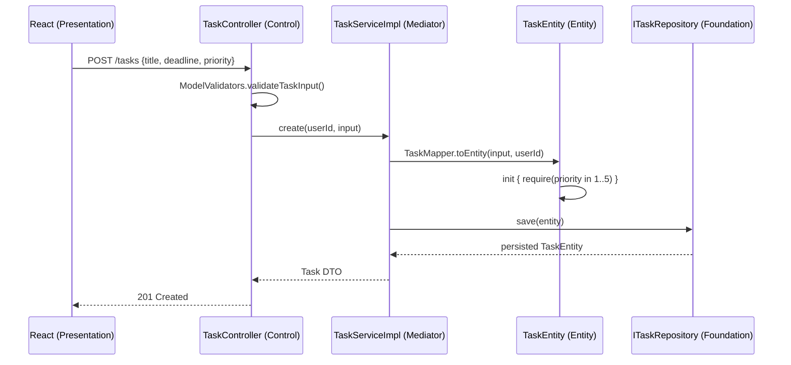
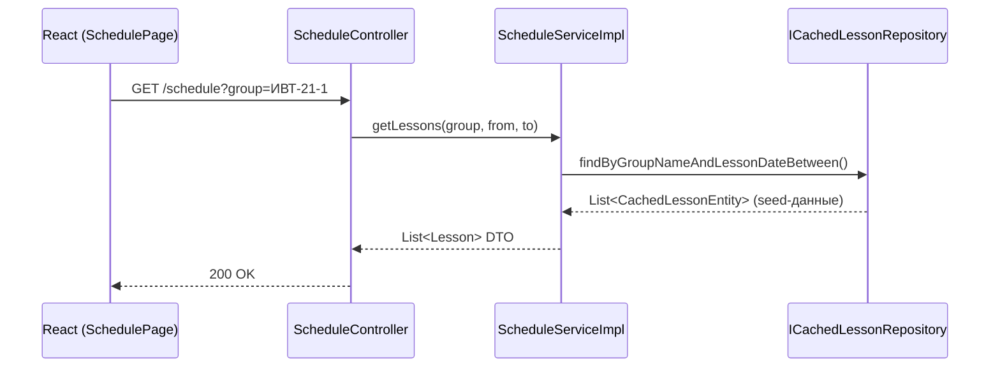

# Диаграммы последовательности

## 1. Login flow

```mermaid
sequenceDiagram
    participant P as React (Presentation)
    participant C as AuthController (Control)
    participant M as AuthServiceImpl (Mediator)
    participant F as IUserRepository (Foundation)
    participant DB as PostgreSQL

    P->>C: POST /auth/login {email, password}
    C->>C: ModelValidators.validateLoginRequest()
    C->>M: login(request)
    M->>F: findByEmail(email)
    F->>DB: SELECT * FROM users WHERE email = ?
    DB-->>F: UserEntity
    F-->>M: UserEntity
    M->>M: passwordEncoder.matches()
    M->>M: jwtService.generateToken()
    M-->>C: LoginResponse{token, user}
    C-->>P: 200 OK
```

## 2. Создание задачи

```mermaid
sequenceDiagram
    participant P as React (Presentation)
    participant C as TaskController (Control)
    participant M as TaskServiceImpl (Mediator)
    participant E as TaskEntity (Entity)
    participant F as ITaskRepository (Foundation)

    P->>C: POST /tasks {title, deadline, priority}
    C->>C: ModelValidators.validateTaskInput()
    C->>M: create(userId, input)
    M->>E: TaskMapper.toEntity(input, userId)
    E->>E: init { require(priority in 1..5) }
    M->>F: save(entity)
    F-->>M: persisted TaskEntity
    M-->>C: Task DTO
    C-->>P: 201 Created
```

## 3. Расписание (текущая реализация — без живого парсера)

```mermaid
sequenceDiagram
    participant P as React (SchedulePage)
    participant C as ScheduleController
    participant M as ScheduleServiceImpl
    participant F as ICachedLessonRepository

    P->>C: GET /schedule?group=ИВТ-21-1
    C->>M: getLessons(group, from, to)
    M->>F: findByGroupNameAndLessonDateBetween()
    F-->>M: List<CachedLessonEntity> (seed-данные)
    M-->>C: List<Lesson> DTO
    C-->>P: 200 OK
```
