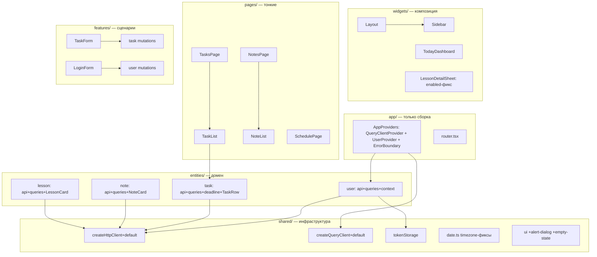

# Дизайн: Рефакторинг фронтенда (web/) — FSD-ориентированная чистая архитектура

## Problem Statement

Фронтенд `web/` уже стоит на FSD-каркасе, но каркас дырявый:

1. **Цикл зависимостей `app → widgets → app`** — `Sidebar`, `TodayDashboard`, `LoginForm`, `SchedulePage` импортируют `useAuth` из `app/providers`. Направленность импортов нарушена (нижние слои тянут верхний).
2. **Auth-логика живёт в `app`** — HTTP, localStorage, контекст, дубли типов в одном `AuthProvider.tsx`; единственный `useEffect` в приложении дублируется в StrictMode.
3. **Смешение уровней абстракции** — `TaskRow` (UI + бизнес-правило + серверная мутация), `AuthProvider` (4 обязанности).
4. **Дублирование** — `TasksPage` ↔ `NotesPage` (копии CRUD), `taskApi`/`noteApi`, query-хуки, формы.
5. **Нет public API** у слайсов — внутренности (`model/queries`) доступны напрямую.
6. **Баги**: timezone-сдвиг дат (UTC vs локальная), round-trip дедлайна, лишние запросы в `LessonDetailSheet`, кэш не чистится при logout, ошибки мутаций проглатываются, мёртвая env-переменная, хрупкий alias `@shared`.

Цель: организованный код, чистый фундамент под дальнейшую доработку, low coupling + high cohesion, инкапсуляция HTTP/состояния, DI где необходимо.

## Constraints

- Не менять контракт KMP-типов (`shared/kmp/`)
- Vite 8 beta не трогаем (инструмент, не архитектура)
- UI-тексты и комментарии — русский, идентификаторы — английский
- Named exports только (default-экспортов нет)
- Только type-only импорты типов (`verbatimModuleSyntax`)
- Не раздувать: без Zustand/Redux (YAGNI), без generic CRUD-абстракций

## Approach

Выбран «modular monolith» по FSD (паттерн адекватен размеру проекта), с исправлением границ модулей:

1. **Auth → `entities/user`** + `useSyncExternalStore` (убирает единственный useEffect)
2. **TaskRow → презентационный**; бизнес-логика в `entities/task/model/deadline.ts`
3. **Фичи `TaskList`/`NoteList`** инкапсулируют CRUD; страницы тонкие
4. **Public API (index.ts)** для каждого слайса entities/* и features/*
5. **DI через фабрики** `createHttpClient` / `createQueryClient` + default-инстансы
6. **Sonner** для глобальных ошибок мутаций; **ErrorBoundary** в app/
7. **Багфиксы** дат, enabled-запросов, очистки кэша, env, alias

## Architecture

### Направленность зависимостей (целевая)

```
app → widgets/pages → features → entities → shared
```

`useAuth` живёт в `entities/user/model` — все слои импортируют оттуда легально. Цикл `app→widgets→app` исчезает.

### Диаграмма



## Components

### shared/
- `api/httpClient.ts` — фабрика `createHttpClient({ baseUrl, getToken })` + default-инстанс; токен через `tokenStorage` (не прямой доступ к localStorage)
- `api/queryClient.ts` — фабрика `createQueryClient(options?)` + default: `staleTime: 30s`, `retry: 1`, глобальный `onError` мутаций → toast
- `lib/tokenStorage.ts` — НОВЫЙ: `get/set/clear/subscribe` (паттерн внешнего стора для `useSyncExternalStore`)
- `lib/date.ts` — фикс `toIsoDate` (локальная дата без `toISOString`), хелперы `toLocalInputValue`/`fromLocalInputValue` для datetime-local
- `ui/` — удалить `separator.tsx`; добавить `alert-dialog.tsx` (подтверждение удаления), `empty-state.tsx`
- Удалить пустые barrel: `constants/index.ts`, `utils/index.ts`, `validators/index.ts`

### entities/user/ (НОВЫЙ)
- `api/userApi.ts` — `me()`, `login()`, `register()`; типы LoginRequest/RegisterRequest/LoginResponse здесь (KMP их экспортирует)
- `model/queries.ts` — `useMeQuery(token)`, `useLoginMutation`, `useRegisterMutation` (onSuccess → `tokenStorage.set` + invalidate me)
- `model/user-context.tsx` — `UserProvider` + `useAuth()`; `token = useSyncExternalStore(tokenStorage.subscribe, tokenStorage.get)`; `logout()` = clear storage + `queryClient.clear()`
- `index.ts` — public API (useAuth, UserProvider)

### entities/task/
- `model/deadline.ts` — НОВЫЙ: `deadlineUrgency` (чистая функция)
- `ui/TaskRow.tsx` — презентационный: props `{ task, onToggle, onClick }`, без мутаций
- `model/queries.ts` — без изменений API, `useToggleTaskMutation` остаётся (вызывается владельцем списка)
- `index.ts` — public API (хуки + TaskRow + deadline)

### entities/note/, entities/lesson/
- Аналогичная структура, `index.ts`
- lesson: `scheduleKeys` (вместо сырых строк), удалить `useGroupsQuery` (мёртвый код)
- `enabled: Boolean(lessonId)` в запросах по lessonId

### features/
- `task/task-list/TaskList.tsx` — НОВЫЙ: список + диалог формы (create/edit) + AlertDialog удаления + EmptyState + мутации
- `note/note-list/NoteList.tsx` — НОВЫЙ: аналогично
- Существующие: `task-form`, `quick-task-dialog`, `note-form`, `login-form`, `week-switcher` — рефакторинг импортов
- Public API `index.ts` для каждого слайса

### widgets/, pages/
- `Sidebar`, `TodayDashboard` — импорт `useAuth` из `entities/user`, использование `useToggleTaskMutation` для TaskRow
- `LessonDetailSheet` — enabled-фикс запросов
- Страницы — тонкая композиция фич

### app/
- `providers/index.tsx` — AppProviders (композиция QueryClientProvider + UserProvider + ErrorBoundary)
- `ErrorBoundary.tsx` — классовый компонент (единственное исключение из «без классов»), русское сообщение + reload
- `AuthProvider` удаляется (заменён entities/user)

## Data Flow

1. **Auth**: `tokenStorage` (внешний стор) → `useSyncExternalStore` в UserProvider → `useMeQuery(token)` → user. Мутации login/register пишут токен в стор → реактивный ре-рендер. Logout чистит storage + query-кэш.
2. **Задачи/заметки**: react-query хуки в `entities/*/model` → `*Api` → `apiClient` (Bearer из tokenStorage). Мутации инвалидируют `keys.all`. Владельцы списков (features) рендерят презентационные TaskRow/NoteCard с колбэками.
3. **Расписание**: `useScheduleQuery(group, from, to)` с `scheduleKeys`, week-диапазон из `date.ts` (локальные даты).

## Error Handling

- **Мутации**: глобальный `onError` в queryClient → `toast.error(message)` (sonner)
- **Запросы**: тихий retry (без спама тостов)
- **Удаление**: подтверждение AlertDialog
- **Формы**: inline-ошибки полей (существующий паттерн)
- **Рендер**: ErrorBoundary с reload-кнопкой
- **401**: отметить как будущую работу (сейчас не блокер)

## Testing Strategy

- **vitest + React Testing Library + MSW** — фундамент
- Unit: `date.ts` (MSK timezone-кейсы), `deadline.ts`, `tokenStorage`, `subjectColor`
- Component: `LoginForm` (валидация+submit), `TaskList` (рендер+удаление)
- MSW-хендлеры: `/auth/*`, `/tasks`, `/notes`
- Проверка: `tsc --noEmit` + `npm run build` после каждого этапа

## Phases

1. **Чистка** — мусор, env (`VITE_API_BASE_URL` в `.env`), alias `@shared` в vite.config
2. **Shared-фундамент** — фабрики httpClient/queryClient, tokenStorage, date-фиксы, alert-dialog/empty-state, sonner
3. **entities/user** — перенос auth, AppProviders, ErrorBoundary, удаление старого AuthProvider
4. **Сущности** — TaskRow презентационный, deadline.ts, scheduleKeys, enabled-фиксы, public API
5. **Фичи** — TaskList/NoteList, рефакторинг форм, public API
6. **Виджеты/страницы** — тонкие страницы, новые импорты
7. **Тесты** — vitest setup + unit + component

## Open Questions

- KMP-типы: получится ли `Pick<KmpTask, ...>` вместо ручных DTO (проверить на этапе 4, fallback — оставить DTO)
- Vite 8 beta — стабилизировать отдельной задачей позже
- Глобальный 401-хендлинг (redirect на login) — будущая работа
